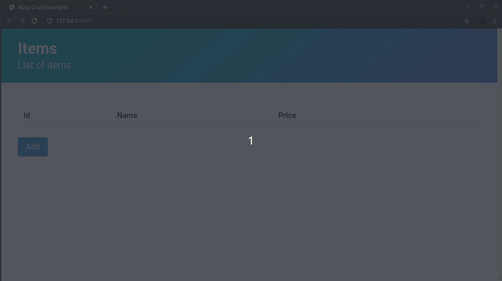

# Rust CRUD



CRUD Basico (Crear, Listar, Actualizar, Eliminar) Aplicación en [Rust] con [Yew Framework] que usa WebAssembly :heart_eyes:.
Continuamos aprendiendo rust, entonces se pueden encontrar algunos errores, pero en general funciona y se pudo hacer uso de Yew y Rust.

[Rust]: https://www.rust-lang.org
[Yew Framework]: https://github.com/yewstack/yew

## Caracteristicas de la Aplicación

* Crear, actualizar and eliminar items
* Local Storage
* Validations
* Ventanas Modal

### Caracteristicas por Implementar

* Ventanas de confirmación
* Filtros
* Paginación

## Como ejecutar la Aplicación

necesitas [Instalar Rust] y [Trunk] despues:

```bash
$ git clone https://github.com/JulianVega03/rust-crud
$ cd rust-crud
$ trunk serve
```

Podrás acceder al servidor web en: `http://127.0.0.1:8080`.

[Instalar Rust]: https://www.rust-lang.org/tools/install
[Instalar Trunk]: https://github.com/thedodd/trunk

## Authors

* **Julián Andrés Becerra Vega** - *Integrante* - [JulianVega03](https://github.com/JulianVega03/)
* **Jairo Andrés Rodriguez Corona** - *Integrante* - [AndresRodriguez27](https://github.com/AndresRodriguez27/)

## License

This project is licensed under the MIT License - see the [LICENSE.md](LICENSE.md) file for details
